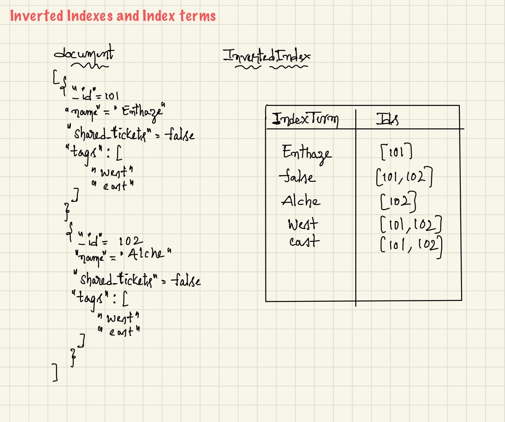

zendesk-search
==============

Zendesk-search is a simple json data search application written in Java 8.

### Requirements
    
* Java 8
* Gradle 6.0

### How to run Application

* git clone https://github.com/Bhargav-Reddy/zendesk-search.git
* go to zendesk-search folder
* run with gradle

    `$ ./gradlew run -q --console=plain`
* (or)run with jar

    ```
  $ ./gradlew clean build
  $ java -cp build/libs/zendesk-search-1.0-SNAPSHOT.jar com.zendesk.search.SearchApplication  
    ```
* (or) Open project in your IDE and launch main method of `com.zendesk.search.SearchApplication`

### External Libraries
* jackson-databind [https://github.com/FasterXML/jackson-databind] : To parse JSON documents to Java objects
* junit-5 : To unit testing

### Search Design
Application has designed based on InvertedIndex and DataStore.
* Each entity(User,Ticket and Organization) have it's own InvertedIndex with all the values in that document
    
    

* Each entity having it's own datastore Id as the key and entity as value
    ```
        eg: Organization datastore
            101 = {_id=101, name=Enthaze, shared_tickets=false, tags=[west,east]
    ```
 * When we search a Term  
    1. It will get Ids associated with that term form respective entity InvertedIndex
    2. Retrieve entities from respective Datastore with Id's get from above step.
 
 
### Search Features
1. Search is case-sensitive
2. To search empty values just pass empty string
    ```
    eg: Enter search term
        description
        Enter search value
        ""
    ```
3.  If search with id you will get related entities
    ```
    eg: If you search Organization with Id, you will get Tickets and Users where that Id is mentioned
        If you search User with Id, you will get Tickets where that Id part of "submitter_id" and "assignee_id"
    ```
 
### Assumptions
* _id is unique and document has just one record per _id     
* _id can't be null
* All the files are valid JSON files
    


    
